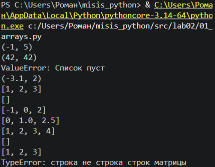
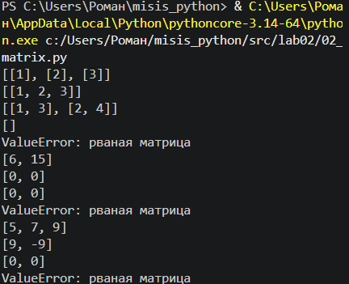
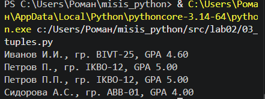

# Лабораторная работа 2
### Ошибки обрабатываются с помощью методов try/except для уменьшения traceback.
## Задание 1
### min_max, unique_sorted, flatten

## Задание 2
### transpose, row_sums, col_sums 
 
## Задание 3
### format_record
 
